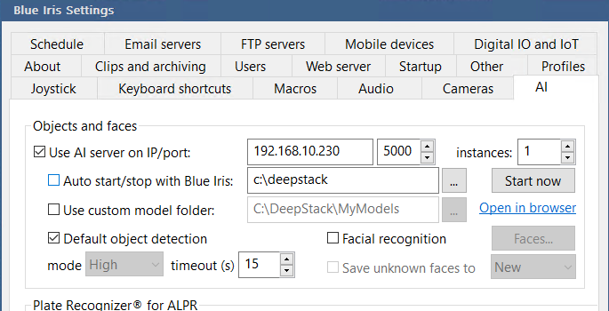
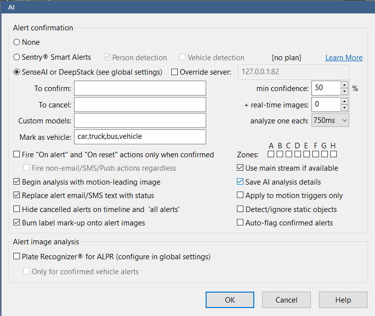

# Introduction
This tool is a shim which allows [AWS Rekognition](https://aws.amazon.com/rekognition/) to be used with [Blue Iris](https://blueirissoftware.com/).  It works by exposing enough of the DeepStack API so that Blue Iris' DeepStack will work, the requests are then proxied to Rekognition and the response transformed to look like what DeepStack would respond with.

# Why?

For my use of AWS Rekognition, the approximate AWS costs are $3CAD/month, whereas an Nvidia Jetson will cost approximately $130CAD, resulting in a payback period of over three years.

I've also found that AWS Rekognition is more accurate than DeepStack in many cases.

Another goal of this is to replace a Node-RED flow that does roughly the same thing with something that's more native to Blue Iris.  The Node-RED flow does three major things:

* Recieves Blue Iris alerts via MQTT and runs them through AWS Rekognition
* Determines whether or not to send the alert, then sends it via Home Assistant
* Logs the image and response from Rekognition to a PostgreSQL database

This shim can replace most of this, apart from the PostgreSQL logging, with only some small code to create the notification remaining in Node-RED.  PostgreSQL logging will not be implemented in this shim because Blue Iris does sufficient logging internally to determine why the AI flagged an image the way it did.  The Python logging module deals with logging that's appropriate to the shim.

# Quick Start
```
# Create venv, install required packages
python3 -m venv venv
. venv/bin/activate
pip install -r requirements.txt

# AWS access details and region
# NOTE:  You can use any method supported by boto3 to pass these parameters
export AWS_ACCESS_KEY_ID=...
export AWS_SECRET_ACCESS_KEY=...
export AWS_DEFAULT_REGION=...

# Run it
python DSShim.py

# Or run it via the flask command...
export FLASK_APP=DSShim
python -m flask run --no-debugger --host 0.0.0.0 --port 5000 
```
NOTE:  Neither option to run this is recommended to run a Flask application in Production.  See the [Flask documentation](https://flask.palletsprojects.com/en/2.1.x/deploying/) for more appropriate options.

A simple option to run it in Production is to use [waitress](https://docs.pylonsproject.org/projects/waitress/en/latest/):
```
# Install
pip install waitress

# Set AWS credentials
export AWS_ACCESS_KEY_ID=...
export AWS_SECRET_ACCESS_KEY=...
export AWS_DEFAULT_REGION=...

# Run it
waitress-serve --listen 0.0.0.0:5000 DSShim:app
```

# Other deployment options

Deployment via a systemd unit and in a Kubernetes cluster is described in the [Deployment Documentation](deployment/README.md).

# Blue Iris Configuration


Select the Use AI server option and point it to the address of the machine that is running the shim.  Do not select any non-default options as these make no sense when using the shim.

# Blue Iris Camera Configuration
This is largely the same as described in the manual, however the names of the labels will be different (e.g., DeepStack returns 'car' vs Rekognition's 'Car').

Camera Settings, Trigger tab, Artificial Intelligence button:


# Important Configuration Notes

Since AWS Rekognition is pay-per-usage, there are some options to be aware of which will greatly impact your AWS bill.

The following options cause Blue Iris to make extra calls to the shim, each call will increase your AWS bill:

* "Detect/ignore static objects" seems to cause periodic calls to the shim to look for static objects.
* "+ real-time images" will cause each motion detection to make multiple calls to the shim based on the settings.
* "Begin analysis with motion-leading image" causes Blue Iris to make an extra call to the shim each time motion is detected.  

Each of these will impact how well the AI can detect things, so it's important to monitor its performance and adjust the settings to suit your needs.

I recommend monitoring the output of the shim after making any changes to see how often Blue Iris is calling it.  I also recommend setting up a budget alert in AWS so that things don't get out of hand.